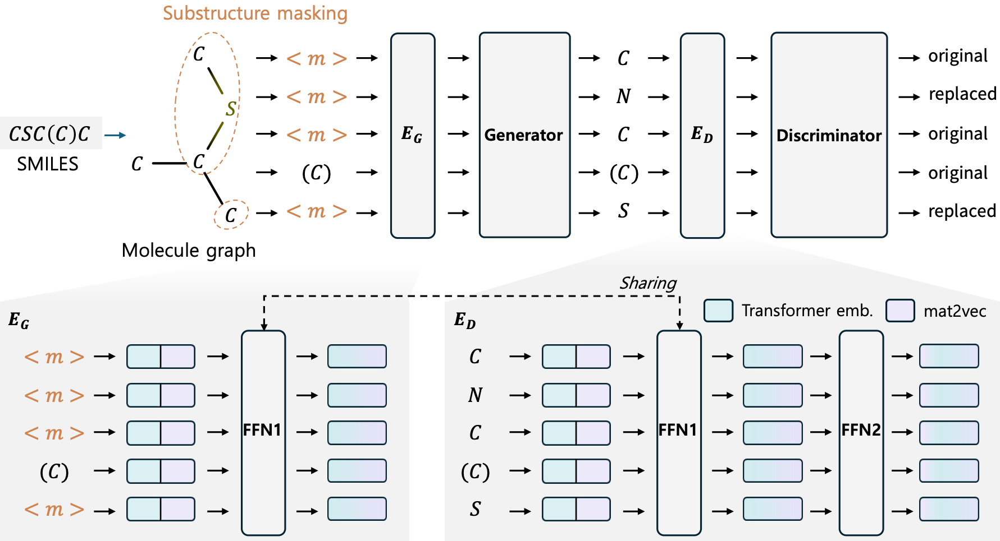

# MolTRES

### **MolTRES: Improving Chemical Language Representation Learning for Molecular Property Prediction \[EMNLP 2024]**
Jun-Hyung Park, Yeachan Kim, Mingyu Lee, Hyuntae Park, and SangKeun Lee

Introduce new techniques based on generator-discriminator training and latent knowledge embedding to improve pre-trained chemical language models [[paper]](https://aclanthology.org/2024.emnlp-main.788.pdf)

This implementation is based on [[IBM/MoLFormer]](https://github.com/IBM/molformer).

## Tested Environments
- Python 3.10
- Pytorch 2.3.1
- Pytorch-lightning 2.2.4
- RDKit 2023.9.6
